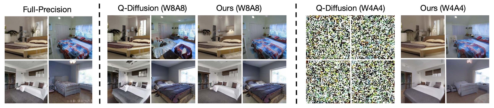
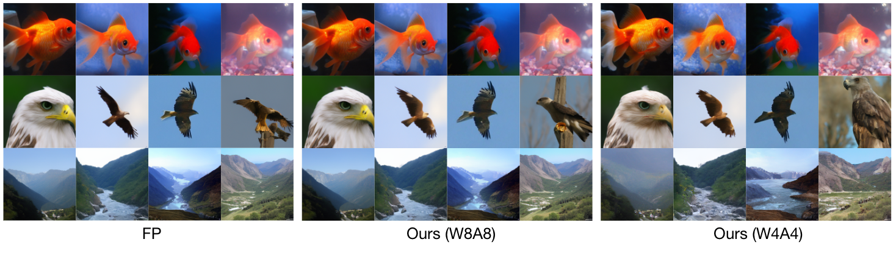
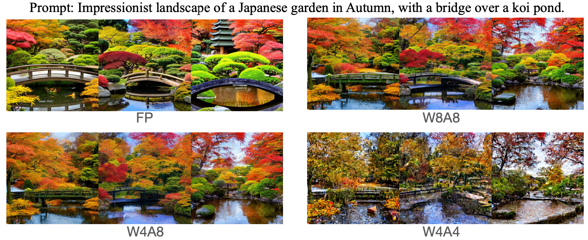

# QuEST
The official repository for **QuEST: Low-bit Diffusion Model Quantization via Efficient Selective Finetuning** [[ArXiv]](https://arxiv.org/abs/2402.03666)

## Update Log 
**(2024.2.28)** Reorganized the code structures.

## Features
QuEST achieves state-of-the-art performance on mutiple high-resolution image generation tasks, including unconditional image generation, class-conditional image generation and text-to-image generation. We also achieve superior performance on full 4-bit (W4A4) generation.   
<p align="center">

</p>
On ImageNet 256*256:
<p align="center">

</p>
On Stable Diffusion v1.4 (512*512):
<p align="center">

</p>

## Get Started
### Prerequisites
Make sure you have conda installed first, then:
```
git clone https://github.com/hatchetProject/QuEST.git
cd QuEST
conda env create -f environment.yml
conda activate quest
```
### Usage
1. For Latent Diffusion and Stable Diffusion experiments, first download relvant checkpoints following the instructions in the [latent-diffusion](https://github.com/CompVis/latent-diffusion/tree/main) and [stable-diffusion](https://github.com/CompVis/stable-diffusion#weights) repos from CompVis. We currently use sd-v1-4.ckpt for Stable Diffusion.
2. The calibration data for LSUN-Bedrooms/Churches and Stable Diffusion (COCO) can be downloaded from the [Q-Diffusion](https://github.com/Xiuyu-Li/q-diffusion/tree/master) repository. We will upload the calibration data for ImageNet soon.
3. Use the following commands to reproduce the models. `act_bit=4` additionally use channel-wise quantization on a more hardware-friendly dimension, which reduces computation cost. Also, exclude the `--running_stat` argument for W4A4 quantization.
4. Change line 151 in ldm/models/diffusion/ddim.py according the the number of timesteps you use, where you can replace '10' with the resulting number of `--c // --cali_st`, e.g. 200 // 20 = 10. Comment line 149~158 if you would like to inference with the FP model.
5. We highly recommend to use checkpoints by QDiffusion and resume it with the `--resume_w` command. 
```
# LSUN-Bedrooms (LDM-4)
python sample_diffusion_ldm_bedroom.py -r models/ldm/lsun_beds256/model.ckpt -n 100 --batch_size 20 -c 200 -e 1.0  --seed 40 --ptq  --weight_bit <4 or 8> --quant_mode qdiff --cali_st 20 --cali_batch_size 32 --cali_n 256 --quant_act --act_bit <4 or 8> --a_sym --a_min_max --running_stat --cali_data_path <cali_data_path> -l <output_path>
# LSUN-Churches (LDM-8)
python scripts/sample_diffusion_ldm_church.py -r models/ldm/lsun_churches256/model.ckpt -n 50000 --batch_size 10 -c 500 -e 0.0 --seed 40 --ptq --weight_bit <4 or 8> --quant_mode qdiff --cali_st 20 --cali_batch_size 32 --cali_n 256 --quant_act --act_bit <4 or 8> --cali_data_path <cali_data_path> -l <output_path>
# ImageNet
python sample_diffusion_ldm_imagenet.py -r models/ldm/cin256-v2/model.ckpt -n 50 --batch_size 50 -c 20 -e 1.0  --seed 40 --ptq  --weight_bit <4 or 8> --quant_mode qdiff --cali_st 20 --cali_batch_size 32 --cali_n 256 --quant_act --act_bit <4 or 8> --a_sym --a_min_max --running_stat --cond --cali_data_path <cali_data_path> -l <output_path>
# Stable Diffusion
python txt2img.py --prompt "a photograph of an astronaut riding a horse" --plms --cond --ptq --weight_bit <4 or 8> --quant_mode qdiff --quant_act --act_bit <4 or 8> --cali_st 25 --cali_batch_size 8 --cali_n 128 --no_grad_ckpt --split --running_stat --sm_abit 16 --cali_data_path <cali_data_path> --outdir <output_path>
```

### Calibration dataset
We will release the calibration data. But you can also generate them yourself by using the following command (10 images per class over all timesteps):
```
python get_calibration_set_imagenet_ddim.py -r <FP_Model_Path> -n 10 --batch_size 10 -c 20 -e 1.0 -seed 40 -l output/ --cond
```

### Evaluation
We use the ADM’s TensorFlow evaluation suite [link](https://github.com/openai/guided-diffusion/tree/main/evaluations) for evaluating FID, sFID and IS. For Stable Diffusion, we generate 10,000 samples based on the prompts from the COCO2014 dataset calculate the average CLIP score.

## Acknowledgement
This project is heavily based on [LDM](https://github.com/CompVis/latent-diffusion/tree/main) and [Q-Diffusion](https://github.com/Xiuyu-Li/q-diffusion/tree/master).

## Citation
If you find this work helpful, please consider citing our paper:
```
@misc{wang2024quest,
      title={QuEST: Low-bit Diffusion Model Quantization via Efficient Selective Finetuning}, 
      author={Haoxuan Wang and Yuzhang Shang and Zhihang Yuan and Junyi Wu and Yan Yan},
      year={2024},
      eprint={2402.03666},
      archivePrefix={arXiv},
      primaryClass={cs.CV}
}
```
